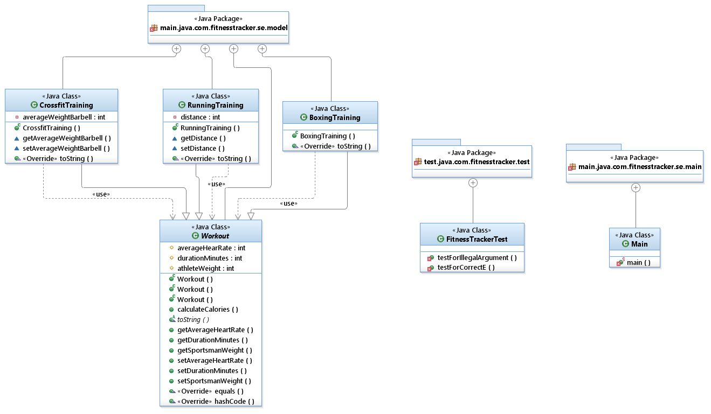

[# Завдання 3: Спорт (ООП)

Написати програму, яка імітує частину функціоналу фітнес-трекера — зберігає та виводить інформацію про тренування.

# Опис задачі

У програмі передбачено три види тренувань:

- Біг
- Кросфіт
- Бокс

### Спільні поля для усіх тренувань:
- Середній пульс під час тренування (ударів на хвилину)
- Тривалість тренування (у хвилинах)
- Вага спортсмена (в кілограмах)

### Особливі поля:
- Бігове тренування: дистанція (в кілометрах)
- Кросфіт: середня вага снаряда

### Методи:
- Обчислення витрат калорій за тренування (спільний метод для усіх типів)
- Виведення всієї інформації (всіх полів) у консоль — має однакову назву та параметри, але різну реалізацію для кожного виду тренування (поліморфізм)

### Формула для обчислення витрат калорій:

[ Е = 0,014 × М × t × (0,12 × П − 7) ]

де:

- \(Е\) — витрата енергії (в кілокалоріях)
- \(М\) — вага спортсмена (в кілограмах)
- \(t\) — тривалість тренування (у хвилинах)
- \(П\) — середній пульс під час тренування (ударів на хвилину)

## Вимоги

- Використати **успадкування** для уникнення дублювання загального коду в класах
- Використати **інкапсуляцію**, щоб поля батьківського класу не були доступні поза класом
- Використати **поліморфізм** для виведення інформації про тренування (кожен тип тренування виводить свої унікальні поля)

## Завдання

- У методі `main` створити масив тренувань за тиждень, наприклад:
    - Два бігові тренування
    - Одне кросфіт-тренування
    - Одне тренування з кікбоксингу
- За допомогою циклу вивести інформацію про всі тренування за тиждень у консоль
 ---
# Реалізація

## Діаграма класів

## Опис
Workout - абстрактний клас, який містить поля:
- averageHearRate - середній пульс/хвилину
- durationMinutes - час тренування(у хвилинах)
- athleteWeight - вага спортсмена

Методи:

- calculateCalories() - спільний метод для всіх класів, який визначає витрату калорій - 
- toString() - абстрактий метод, який перевизначається у всіх похідний класах
- get...() - для отримання значеннь
- set...() - для встановалення значень
- equals() - для перевірки рівності об'єктів, оскільки при порівнянні == порівнюються посилання об'єктів
- hashCode() - шифрування об'єкту

toString() — це метод, оголошений у класі Object (базовому класі, від якого успадковуються всі класи в Java). Він використовується для отримання текстового представлення об'єкта. Залежно від реалізації, можна отримати різну інформацію про об'єкт. Основна перевага полягає в тому, що цей метод викликається автоматично, наприклад, під час виведення об'єкта через System.out.println(). У моїй програмі toString() перевизначається в усіх похідних класах, що демонструє принцип поліморфізму.

Також було добавлено тестування, а саме:
- testForIllegalArgument() - перевірка правильності аргументів
- testForCorrectE() - перевірка розрахунку
